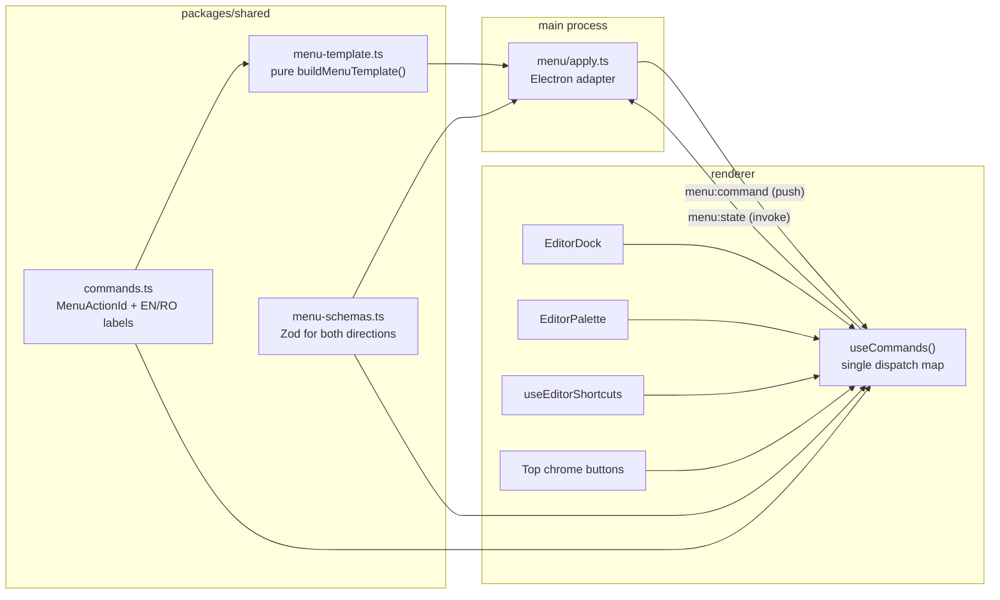

# ThermalBridge — Desktop Menus and UX Restructure

Implementation handoff. Written for an engineer or agent with **no prior context** on this repo.

Status: not started. Scope approved by the repo owner on 2026-09-12.

---

## 1. What this project is

ThermalBridge is an Electron desktop app for printing shipping labels (AWB) and documents to thermal label printers (Marklife X4, Phomemo M110, planned D210) and to Canon inkjets via the OS print queue.

Monorepo, pnpm workspaces, strict TypeScript:

- `apps/desktop` — Electron app
  - `src/main` — main process (IPC, printing, settings, library store)
  - `src/preload` — contextBridge API
  - `src/renderer` — React 19 + Tailwind 4 + Radix (shadcn-style) + Konva canvas
- `packages/shared` — Zod schemas, IPC channel names, domain types. **Imported by main, preload, and renderer.**
- `packages/thermal-core` — platform-independent bitmap/label encoding
- `packages/printer-profiles` — printer capability profiles
- `native/printbridge` — Rust sidecar for transports (CUPS, USB, BLE, SPP, TCP)

Commands:

```bash
pnpm install --frozen-lockfile
pnpm lint
pnpm typecheck
pnpm test              # vitest across packages + node --test for release scripts
pnpm test:coverage     # enforces thresholds, see §10
pnpm dev               # builds the Rust sidecar, then electron-vite dev
```

---

## 2. Non-negotiable rules

These come from `.cursor/rules/thermalbridge.mdc` and are enforced in review.

- Work in small, reviewable increments. Do not refactor unrelated modules.
- Preserve strict TypeScript: `strict`, `noUncheckedIndexedAccess`, `exactOptionalPropertyTypes`.
- Avoid `any`. Use `unknown` at Zod/IPC boundaries.
- **Validate all IPC data with Zod.** Both directions.
- Keep `thermal-core` platform-independent — no Electron or Node imports.
- Use `.js` extensions on all relative TypeScript ESM imports (e.g. `import { x } from './y.js'`).
- Electron security is fixed and must not change:
  ```ts
  webPreferences: { nodeIntegration: false, contextIsolation: true, sandbox: true }
  ```
  Never expose `ipcRenderer` itself to the renderer. Only wrapped functions via `contextBridge`.
- Write tests before changing behavior (TDD). A task is not done until lint, typecheck, and tests pass, and no debug console spam remains.
- Do not commit unless explicitly asked.

---

## 3. Current state (verified 2026-09-12)

### 3.1 There is no native menu

`apps/desktop/src/main/index.ts:39` sets `autoHideMenuBar: true`. There is no `Menu.setApplicationMenu` call anywhere in the repo.

Consequence beyond missing menus: **on macOS, Cmd+C / Cmd+V / Cmd+A do not work in text inputs**, because Electron relies on the Edit menu's built-in roles to supply clipboard behavior. Adding the Edit menu fixes a real bug.

### 3.2 There is no main-to-renderer channel

All 26 channels in `packages/shared/src/ipc.ts` are `ipcMain.handle` + `ipcRenderer.invoke`. A repo-wide search finds no `webContents.send`, no `ipcMain.on`, and no `ipcRenderer.on`. The push channel for menu clicks must be built from scratch.

The preload API (`apps/desktop/src/preload/api.ts`) is exposed as `window.thermalBridge` and typed by `ThermalBridgeAPI` in `packages/shared/src/api.ts`.

### 3.3 Actions are wired three times, with duplicated labels

The same editor actions are declared independently in:

- `apps/desktop/src/renderer/src/features/editor/use-editor-shortcuts.ts` — a 16-entry `keydown` switch, props `onAddText`, `onAddQr`, …
- `apps/desktop/src/renderer/src/features/editor/EditorPalette.tsx:52-91` — a `PaletteCommand[]` array repeating every label and a hardcoded `shortcut` string
- `apps/desktop/src/renderer/src/features/editor/EditorDock.tsx` — buttons repeating the same labels and shortcut hints

Adding a fourth surface (the native menu) by copying this pattern again would make drift worse. The fix is a single registry — see §5.

### 3.4 Modals are hand-rolled and inaccessible

Four overlays, all `fixed inset-0 z-50` divs with a backdrop `onClick` and an inner `stopPropagation`:

- `features/printers/ConnectPrinterDialog.tsx:33-76` — no Escape, no focus trap, no `role="dialog"`
- `features/editor/EditorPalette.tsx:107-158` — Escape only while the input has focus
- `features/editor/EditorIconPicker.tsx:15-59` — Escape only via the global shortcut hook
- `App.tsx:1594-1664` — inline save-template dialog, no Escape

None trap focus, none set `aria-modal`, and backdrop opacity differs (`bg-black/50` vs `bg-black/60`).

`apps/desktop/src/renderer/src/components/ui/` has 15 primitives but **no `dialog.tsx`, `popover.tsx`, or `sheet.tsx`**. The installed `radix-ui` unified package (`^1.6.7`) exports `Dialog`, so this needs no new dependency — the existing `dropdown-menu.tsx` already imports that way:

```ts
import { DropdownMenu as DropdownMenuPrimitive } from "radix-ui"
```

Also unused: `badge.tsx`, `separator.tsx`.

### 3.5 Duplicated and buried actions

Duplicated:

- **Print** — `EditorTopChrome.tsx:112-120` and `PrintPane.tsx:523-525`
- **Connect printer** — top chrome, `PrintPane.tsx:130-139`, the Printers screen, and the modal itself
- **Enhance / Revert** — `PhotoCleanupBanner.tsx:17-19` and `PrintPane.tsx:361-381`
- **Test print** — `PrintPane.tsx:526-533` and `CalibrationPane.tsx:59-61` (same handler)

Buried or unreachable:

- Add / duplicate / delete **page** exist only on a hover toolbar inside `EditorPageStack.tsx:45-62`
- **Language** exists only in the sidebar dropdown, `App.tsx:1217-1238`
- **Deselect** is Escape-only
- `PrintDraft.threshold` (`state/types.ts:29`) is sent to the printer but has **no UI at all**

### 3.6 Dead code to delete

- `apps/desktop/src/renderer/src/features/import/SourcePane.tsx` — a complete left "sources" pane, never imported
- `apps/desktop/src/renderer/src/features/editor/EditorToolbar.tsx` — a duplicate of `EditorDock`, never imported

### 3.7 Locale

`locale` is persisted in `settings.json` and validated in `packages/shared/src/settings.ts:42` as `z.enum(['en','ro'])`, defaulting to `'ro'`. The renderer duplicates the locale union in `apps/desktop/src/renderer/src/i18n/messages.ts:1-2`.

`apps/desktop/src/renderer/src/i18n/i18n.test.ts` asserts EN and RO have identical key sets. **Any new message key must be added to both locales or this test fails.**

---

## 4. Target architecture



Two principles:

1. **`buildMenuTemplate(state, locale, platform)` is a pure function** returning plain objects, with no `electron` import. It lives in `packages/shared` and is fully unit-testable. A thin main-process adapter converts the result into `Menu.buildFromTemplate`. This is required — `packages/shared` must stay Electron-free, and the coverage gate makes an untestable menu builder painful.
2. **One command registry is the single source of truth** for every action's id, label, and accelerator. The menu, the palette, the dock, and the keyboard hook all read from it.

Main already imports `@thermalbridge/shared`, and `electron.vite.config.ts` bundles workspace packages into the main build via `externalizeDepsPlugin({ exclude: workspacePackages })`, so this import path works with no build changes.

---

## 5. The command registry

New file: `packages/shared/src/commands.ts`.

```ts
export type MenuActionId =
  // File
  | 'file.open' | 'file.saveTemplate' | 'file.applyTemplate' | 'file.exportDiagnostics'
  // Edit
  | 'edit.duplicate' | 'edit.delete' | 'edit.deselect'
  // Insert
  | 'insert.text' | 'insert.qr' | 'insert.barcode'
  | 'insert.box' | 'insert.line' | 'insert.circle' | 'insert.arrow'
  | 'insert.icon' | 'insert.image' | 'insert.table' | 'insert.field'
  // Label
  | 'label.size' | 'label.addPage' | 'label.duplicatePage' | 'label.deletePage'
  | 'label.fitMode' | 'label.rotateLeft' | 'label.rotateRight'
  | 'label.enhance' | 'label.revertEnhance'
  // Print
  | 'print.print' | 'print.testPage' | 'print.connect'
  | 'print.selectPrinter' | 'print.selectProfile'
  // View
  | 'view.screen' | 'view.zoomIn' | 'view.zoomOut' | 'view.zoomActual'
  | 'view.toggleGrid' | 'view.commandPalette' | 'view.language';
```

Each entry carries: `id`, `labelKey`, `accelerator` (display string), `registerAccelerator` (boolean, see §6.3), and an optional `payloadSchema` for parameterised commands (`label.size`, `view.screen`, `print.selectPrinter`, `view.language`).

Menu labels live in the same module as `MENU_MESSAGES: Record<Locale, Record<MenuMessageKey, string>>`, so the main process can localize without importing renderer code. Move `Locale` / `LOCALES` into `packages/shared/src/settings.ts` (which already owns the `z.enum(['en','ro'])`) and have `renderer/src/i18n/messages.ts` re-export them so nothing else breaks.

Renderer side, new file `apps/desktop/src/renderer/src/features/commands/use-commands.ts`:

```ts
export type CommandHandlers = Record<MenuActionId, (payload?: unknown) => void>;
export function useCommands(): { run: (id: MenuActionId, payload?: unknown) => void };
```

A compile-time exhaustiveness check must guarantee every `MenuActionId` has a handler. Add a test asserting the handler map keys equal the registry keys.

---

## 6. Native menu

### 6.1 Structure

`ThermalBridge` (macOS only)
- About, Settings, Services, Hide, Hide Others, Quit — Electron roles

`File`
- Open… `CmdOrCtrl+O` → `file.open`
- Save as Template… `CmdOrCtrl+S` → `file.saveTemplate`
- Apply Template ▸ — dynamic submenu built from `library.listTemplates()`
- Export Diagnostics… → `file.exportDiagnostics`
- separator, then Close Window / Quit (Exit on Windows and Linux)

`Edit`
- Undo, Redo, Cut, Copy, Paste, Select All — **Electron roles only** (this is the macOS clipboard fix)
- separator
- Duplicate `CmdOrCtrl+D`, Delete, Deselect

`Insert`
- Text (T), QR Code (Q), Barcode (B)
- separator, Box (R), Line (L), Circle (O), Arrow (A)
- separator, Icon… (S), Image… (I), Table (E), Date/Serial Field (F)

`Label`
- Label Size ▸ — radio, from the active profile's `labelSizes`
- separator, Add Page, Duplicate Page, Delete Page
- separator, Fit Mode ▸ (Fit / Fill / Actual / Stretch, radio)
- Rotate Left, Rotate Right
- separator, Enhance Image, Revert Enhancement

`Print`
- Print `CmdOrCtrl+P`, Print Test Page
- separator, Connect Printer… `CmdOrCtrl+Shift+P`
- Printer ▸ (radio, from discovered printers), Profile ▸ (radio)

`View`
- Print `CmdOrCtrl+1` … Diagnostics `CmdOrCtrl+6` (radio over the six screens in `state/types.ts:5`)
- separator, Zoom In `CmdOrCtrl+=`, Zoom Out `CmdOrCtrl+-`, Actual Size `CmdOrCtrl+0`
- Toggle Grid (checkbox)
- separator, Command Palette… `CmdOrCtrl+K`, Language ▸ (radio EN/RO)
- separator, Reload and Toggle DevTools — **only when `!app.isPackaged`**

`Window` (macOS roles), `Help` (external links via `shell.openExternal`, plus About on Windows and Linux).

Set `autoHideMenuBar: false` in `createWindow()` so the bar is visible on Windows and Linux.

### 6.2 IPC contract

Add to `packages/shared/src/ipc.ts`:

- `MENU_COMMAND: 'menu:command'` — main to renderer, via `webContents.send`
- `MENU_STATE: 'menu:state'` — renderer to main, via `invoke`

`MenuState` (Zod-validated in main before rebuilding the menu):

```ts
{
  screen: Screen;
  locale: Locale;
  hasSelection: boolean;
  hasSource: boolean;
  canPrint: boolean;
  isEnhanced: boolean;
  showGrid: boolean;
  fitMode: FitMode;
  pageCount: number;
  labelSizes: Array<{ widthMm: number; heightMm: number; displayName: string }>;
  activeLabelSize: { widthMm: number; heightMm: number };
  printers: Array<{ id: string; name: string }>;
  activePrinterId: string;
  profiles: Array<{ id: string; displayName: string }>;
  activeProfileId: string;
  templates: Array<{ id: string; name: string }>;
}
```

Preload additions (wrapped, never exposing `ipcRenderer`):

```ts
menu: {
  setState(state: MenuState): Promise<void>;
  onCommand(handler: (command: MenuCommand) => void): () => void; // returns unsubscribe
}
```

The renderer pushes `menu.setState(...)` from a `useEffect` whose deps are the state fields above. **Debounce or shallow-compare before sending** — rebuilding the Electron menu on every React render is expensive and will flicker submenus on macOS.

### 6.3 Critical gotcha: do not double-fire shortcuts

Electron menu accelerators fire even when focus is inside a text input. If `T` is registered as a native accelerator for Insert Text, the user cannot type the letter "t" into the barcode value field.

The rule:

- **Single-key accelerators** (`T Q B R L O A S I E F G`, `Backspace`, `Delete`, `Escape`) must use `registerAccelerator: false`. Electron still *displays* the key in the menu, but does not capture it. The renderer's `use-editor-shortcuts.ts` keeps handling them, and its existing `isTypingTarget()` guard (lines 23-33) keeps inputs safe.
- **Modifier accelerators** (`CmdOrCtrl+O/S/P/D/K/1-6/=/-/0`) are registered natively. When you do this, **remove the matching branches from `use-editor-shortcuts.ts`** — specifically the `Cmd+K` branch (lines 53-56) and the `Cmd+D` branch (lines 58-61) — or both the menu and the hook will fire and you will get two duplicated overlays.

Write a test that asserts no registry entry has both `registerAccelerator: true` and a modifier-free accelerator.

### 6.4 Modal gating

Today `App.tsx:1388` passes `shortcutsEnabled={!connectOpen}`, so shortcuts are only suppressed for the printer dialog. Replace with an open-modal counter (a small context or a `useState` count incremented by the new `Dialog` wrapper) so shortcuts *and* menu commands are suppressed for every dialog. Menu items that mutate the canvas should be disabled in `MenuState` while a modal is open.

---

## 7. Modal restructure

Add `apps/desktop/src/renderer/src/components/ui/dialog.tsx` following the existing shadcn pattern (see `dropdown-menu.tsx` for the exact import style and `data-slot` convention).

Migrate all four overlays to it. Each gains, for free: Escape to close, focus trap, focus restore on close, `role="dialog"`, `aria-modal`, and a labelled title.

- `ConnectPrinterDialog` — keep the `Card` + `ScrollArea` body, drop the hand-rolled backdrop
- `EditorPalette` — keep the filter input and Enter-runs-first-match behavior; remove the input-scoped Escape handler since Dialog handles it
- `EditorIconPicker` — add keyboard navigation across the icon grid
- Save-template dialog — extract from `App.tsx:1594-1664` into `features/library/SaveTemplateDialog.tsx`; `App.tsx` is ~1800 lines and should not grow

---

## 8. Deduplication

Every action gets exactly one in-app home, plus the menu:

- **Print** — keep `EditorTopChrome`, remove the `PrintPane` footer button
- **Connect printer** — keep top chrome and the Printers screen, remove the `PrintPane` button
- **Enhance / Revert** — keep the `PrintPane` Image section; reduce `PhotoCleanupBanner` to a notice with one Revert affordance
- **Language** — remove from the sidebar, now in the View menu (and the Settings surface)
- **Test print** — keep both; they are genuinely different contexts (print settings vs calibration), but they must share one handler and one label

Delete `SourcePane.tsx` and `EditorToolbar.tsx`. Delete `badge.tsx` and `separator.tsx` only if still unused after the rework.

---

## 9. Layout rework

**Sidebar** (`App.tsx:1190-1238`): currently a flat `w-48` list of six items plus the language dropdown. Change to a collapsible rail — `w-48` expanded, `w-14` icon-only collapsed, persisted in settings — with three groups:

- Workspace: Print
- Content: History, Library
- Device: Printers, Calibration, Diagnostics

The window minimum is 1240px (`main/index.ts:34`), so reclaiming 34px matters on small laptops.

**Right aside** (`App.tsx:1392-1465`): currently `EditorInspector` stacked above `PrintPane` inside `w-[18rem]`, with the inspector capped at `max-h-[min(22rem,45%)]`. Both panes are cramped whenever an overlay is selected. Convert to a two-tab pane using the existing `components/ui/tabs.tsx`: **Inspector** and **Print**, auto-switching to Inspector on selection. Full height for whichever is active.

---

## 10. Testing and coverage

Coverage thresholds are enforced at **80% lines / functions / statements, 70% branches** in `apps/desktop/vitest.config.ts`, `packages/shared/vitest.config.ts`, `packages/thermal-core/vitest.config.ts`, and `packages/printer-profiles/vitest.config.ts`.

Note the desktop config's coverage `include` covers `src/main/**/*.ts` and `src/renderer/src/features/**/*.ts`. New files land inside those globs, so they need tests or an explicit `exclude` entry. The Electron adapter (`menu/apply.ts`) cannot be unit-tested without Electron — keep it a thin, near-logic-free file and add it to `exclude`, with all real logic in the pure template builder.

Required new tests:

- `packages/shared` — `buildMenuTemplate` structure, accelerators, radio/checkbox state, macOS vs Windows/Linux differences, disabled states when `hasSelection` is false
- `packages/shared` — registry completeness: every `MenuActionId` has a label in EN and RO
- `packages/shared` — the `registerAccelerator` safety rule from §6.3
- `packages/shared` — Zod schemas for `MenuState` and `MenuCommand`, including rejection of unknown action ids
- `apps/desktop` — command dispatch map covers every `MenuActionId`
- `apps/desktop` — Dialog Escape, focus trap, and focus restore

Gate before calling any phase done:

```bash
pnpm lint && pnpm typecheck && pnpm test:coverage
```

Manual smoke on macOS, since these cannot be unit-tested:

1. Cmd+C / Cmd+V / Cmd+A work inside the barcode value input
2. Typing "test" into a text overlay does not insert QR codes or toggle the grid
3. Cmd+K opens the palette exactly once
4. Every menu item fires, and items grey out correctly with nothing selected

---

## 11. Suggested phase order

Each phase should be independently reviewable and leave the app working.

1. **Shared registry** — move `Locale`/`LOCALES` to shared, add `commands.ts` with ids and EN/RO labels, add parity test. No behavior change.
2. **Pure template builder** — `buildMenuTemplate` plus its full test suite. Still not wired.
3. **IPC channels** — `menu:command` and `menu:state`, Zod schemas, preload `menu.onCommand` / `menu.setState`, extend `ThermalBridgeAPI`.
4. **Main wiring** — Electron adapter, `Menu.setApplicationMenu`, rebuild on state and locale change, `autoHideMenuBar: false`. Menu now visible and functional.
5. **Renderer dispatch** — `useCommands()`, then refactor `use-editor-shortcuts`, `EditorPalette`, and `EditorDock` to dispatch through it and read labels from the registry. Apply the §6.3 accelerator rules here.
6. **Dialog primitive** — add `dialog.tsx`, migrate all four modals, replace `shortcutsEnabled` with the modal counter.
7. **Dedupe and dead code** — §8, delete `SourcePane.tsx` and `EditorToolbar.tsx`.
8. **Layout rework** — collapsible sidebar rail, tabbed right pane.
9. **Docs** — document the menu structure and the command registry under `docs/`, and update `docs/testing.md`.

---

## 12. Known traps

- Adding a message key to only one locale breaks `i18n.test.ts`. Always edit EN and RO together.
- `exactOptionalPropertyTypes` is on. Build optional object properties with spreads: `...(x !== undefined ? { x } : {})`. The codebase does this consistently — follow it.
- Relative imports need `.js` extensions, including in tests.
- Do not import `electron` from `packages/shared`. It will break the renderer build and violate the layering rule.
- `EditorIconPicker` currently has no keyboard handling at all; migrating it to Dialog is the moment to add it.
- `PrintDraft.threshold` has no UI. Out of scope here, but note it if you touch `PrintPane`.
- The repo owner does not want commits unless asked.
